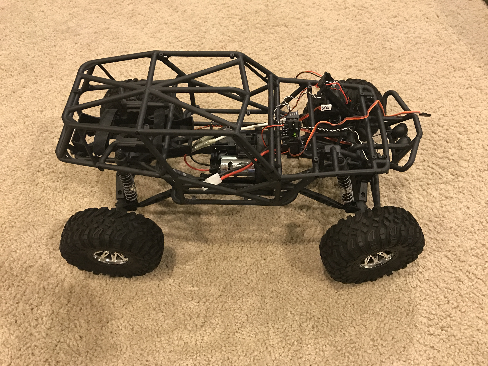

# Robot Autonomous NaviGatER (Ranger)

**New, haven't done anything yet**

Currently, I have only disassembled the truck. 

This is what it was:

[Axial Racing Wraith](http://www.axialracing.com/products/ax90018)

## Research/Testing

- This thing draws a lot of current, tried testing it with a battery pack I had
  and it pulled so much current, it melted the leads off the pack.
- In order to talk with the ESC, you need to first set it to full throttle and
  then set it to min throttle for the ESC to work [ref](http://www.rototron.info/raspberry-pi-esc-motor-tutorial/)
      
      import pigpio   # not sure how good this is??
      pi = pigpio.pi()
      ESC_GPIO = 13  # ESC pwm set to RPi pin 13
      pi.set_servo_pulsewidth(ESC_GPIO, 2000) # Maximum throttle.
      sleep(2)
      pi.set_servo_pulsewidth(ESC_GPIO, 1000) # Minimum throttle.
      sleep(2)

# Licenses

**Note:** The software, hardware, and documentation are under different licenses.

## Software

**The MIT License (MIT)**

Copyright (c) 2016 Kevin J. Walchko

Permission is hereby granted, free of charge, to any person obtaining a copy of
this software and associated documentation files (the "Software"), to deal in
the Software without restriction, including without limitation the rights to
use, copy, modify, merge, publish, distribute, sublicense, and/or sell copies
of the Software, and to permit persons to whom the Software is furnished to do
so, subject to the following conditions:

The above copyright notice and this permission notice shall be included in all
copies or substantial portions of the Software.

THE SOFTWARE IS PROVIDED "AS IS", WITHOUT WARRANTY OF ANY KIND, EXPRESS OR
IMPLIED, INCLUDING BUT NOT LIMITED TO THE WARRANTIES OF MERCHANTABILITY, FITNESS
FOR A PARTICULAR PURPOSE AND NONINFRINGEMENT. IN NO EVENT SHALL THE AUTHORS OR
COPYRIGHT HOLDERS BE LIABLE FOR ANY CLAIM, DAMAGES OR OTHER LIABILITY, WHETHER
IN AN ACTION OF CONTRACT, TORT OR OTHERWISE, ARISING FROM, OUT OF OR IN
CONNECTION WITH THE SOFTWARE OR THE USE OR OTHER DEALINGS IN THE SOFTWARE.

## Hardware and Documentation

 This work is licensed under a <a rel="license" href="http://creativecommons.org/licenses/by-sa/4.0/">Creative Commons Attribution-ShareAlike 4.0 International License</a>.
