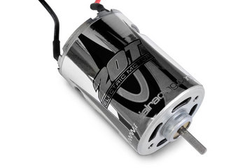

# Specs

## 20T Motor

- Prewired with 4mm male bullet connectors
- Shaft Diameter: 3mm (0.12″)
- Shaft Length: 12.45mm (0.49″)
- Can Diameter: 36mm (1.42″)
- Can Length: 49.7mm (1.96″)
- Total Length: 69.5mm (2.73″)
- Wire length: 88.9mm (3.5″)

## AE-2 ESC

- Input voltages: 6 Cell Ni/2S LiPo
- Size: 1.7x1.24 in
- Motor Limit: >= 19T
- on-Resistance FET: 0.0018 Ohm
- Rated/Peak Current: 106A Peak
- Braking Current: 106A Peak
- BEC: 5V/2A Peak
- PWM Frequency: 6kHz
